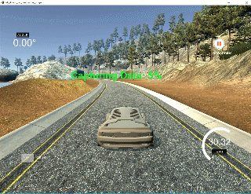

# **Behavioral Cloning** 

**Behavioral Cloning Project**

The goals / steps of this project are the following:
* Use the simulator to collect data of good driving behavior
* Build, a convolution neural network in Keras that predicts steering angles from images
* Train and validate the model with a training and validation set
* Test that the model successfully drives around track one without leaving the road
* Summarize the results with a written report

---
### Model Architecture and Training Strategy

#### 1. Model architecture

My model uses a convolutional neural network architecture used by NVIDIA from their self-driving car research.    The layers of the NVIDIA network are shown in the figure below.

​	 

The first layer (bottom) is a normalization layer.  It is followed by five convolutional layers.   The first three convolutional layers use 2x2 strides and 5x5 kernels.   The next two layers use non-strided convolutions with 3x3 kernels.  

The convolutional layers are followed by 3 fully connected layers.  The final output layer is a single value which represents the steering angle.

The model includes RELU activation for each convolutional layer to introduce nonlinearity.  The data is cropped and normalized using Keras Cropping2D and Lambda layers.(code lines 127 and 128). 

#### 2. Attempts to reduce overfitting 

The model contains dropout layers after each step in order to reduce overfitting (model.py lines 129-146). 

The model was trained and validated on several different data sets to ensure that the model was not overfitting (code lines 33-54). The model was tested by running it through the simulator on both the easy and more difficult tracks and ensuring that the vehicle could stay on the track.

#### 3. Model parameter tuning

The model used an adam optimizer (model.py line 150).  The learning rate was not tuned manually.

#### 4. Appropriate training data

Training data was chosen to keep the vehicle driving on the road. I used a combination of center lane driving, recovering from the left and right sides of the road, driving on easy and difficult tracks, and driving in alternate track directions.

For details about how I created the training data, see the next section. 

### Model Architecture and Training Strategy

#### 1. Solution Design Approach

The overall strategy for deriving a model architecture was to arrive at a solution that would work well on both tracks without overfitting.

My first step was to use a convolutional neural network model based on NVIDIA's autonomous vehicle mode as it was proven very effective in this problem space.  The details are described above in the section labeled "Model Architecture and Training Strategy".

In order to measure how well the model was working, I split my image and steering angle data into a training and validation sets (code line 116). 

To combat the overfitting, I added dropout steps to the model after each layer and reduced the number of training EPOCHS to 16.  

I then tested the model in the simulator.  It ran ok, but had issues on specific turns near water.  I then realized (after re-reading the project instructions) my training code used the BGR color map to feed the model while the simulator used RGB images.   I corrected this issue, reran the test, and corrected the turn issue. 

I trained the model for 16 epochs; the point at which the validation loss stopped decreasing.

The next steps were to run the simulator to see how well the car was driving around the test tracks.  The vehicle successfully drove around track one.  It drove pretty well over track two except when it reached a section with sharp turns.  To overcome this, I added new training data by driving through the hard turns on track two as shown below.

After retraining the model with the new data, the vehicle was able to successfully navigate both tracks.

#### 2. Final Model Architecture

The final model architecture (model.py lines 126-147) consisted of a convolution neural network with the following layers and layer sizes .

My final model consisted of the following layers:

|       Layer       |               Description                |
| :---------------: | :--------------------------------------: |
|       Input       |          160x320x3 color image           |
|    Cropping2D     | Copped 60 pixels from top and 25 from bottom - outputs 75x320x3 |
|      Lambda       | Normalize pixel data between to a range between -0.5 and 0.5 |
| Convolutional 5x5 | 2x2, stride, same padding, outputs 36x158x24 |
|       RELU        |                                          |
|      Dropout      |                   20%                    |
|  Convolution 5x5  | 2x2 stride, same padding, outputs 16x77x36 |
|       RELU        |                                          |
|      Dropout      |                   20%                    |
|  Convolution 5x5  | 2x2 stride, same padding, outputs 6x37x48 |
|       RELU        |                                          |
|      Dropout      |                   20%                    |
|  Convolution 3x3  | 1x1 stride, same padding, outputs 4x35x64 |
|       RELU        |                                          |
|      Dropout      |                   20%                    |
|  Convolution 3x3  | 1x1 stride, same padding, outputs 2x33x64 |
|       RELU        |                                          |
|      Dropout      |                   20%                    |
|      Flatten      |               output 4224                |
|  Fully Connected  |                output 100                |
|      Dropout      |                   20%                    |
|  Fully Connected  |                output 50                 |
|      Dropout      |                   20%                    |
|  Fully Connected  |                output 10                 |
|      Dropout      |                   20%                    |
|      Output       |        output 1 - steering angle         |

#### 3. Creation of the Training Set & Training Process

I first recorded four laps of good center lane driving on track one from Udacity's simulator.   Here is an example of of center lane driving within the simulator:

I then recorded the vehicle recovering from the left side and right sides of the road back to center so that the vehicle would learn to return to the center of the lane. The following animation shows what a recovery looks like starting from outside of a lane.

Then I repeated this process on track two in order to get more data points.

The original data set captured from the simulator included 22,839 angel measurements.  The shows distribution of steering angels captured from the simulation laps.   The majority of the measurements are near 0.00.

To augment the data sat, I flipped images and angles thinking that this would balance out the fact that most of the turns in the training data were left turns.  Here is an image that has then been flipped.

I also cropped out the vehicle bonnet and top sections of the input images to remove irrelevant data . Here is an example of the cropping applied.

After augmenting the data set I had 91,356 number of data points.   The following shows the distribution of angles from the augmented data set.

I finally randomly shuffled the data set and put 20% of the data into a validation set. 

I used this training data for training the model. The validation set helped determine if the model was over or under fitting. The ideal number of epochs was 16 as evidenced by the fact that the training loss stopped decreasing. I used an adam optimizer so manually training the learning rate wasn't necessary.
